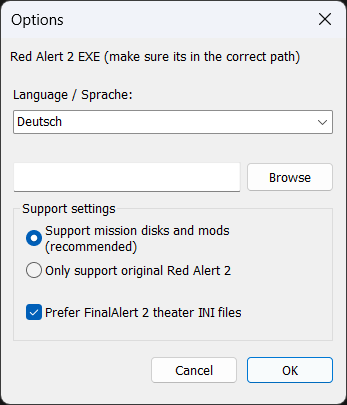

# FinalAlert（尤里的复仇）地图编辑器 RN 特别版

本项目是《FinalAlert（YR）地图编辑器》 RN 团队二次开发强化版本（下文以"FR - Final Revenge"、"RN定制版地图编辑器"或"本编辑器"代称），虽然名为"RN特别版"，但是也期望可以支持除RN之外的Mod和原版游戏。
本编辑器对EA开源程序进行了大量重构优化，对软件开发维护者的开发体验和地图编辑器用户的使用体验都有很大的提升，我们旨在于打造一个易于维护的、功能友好的工具软件。

本软件必须在现代64位操作系统下才能正常运行。

## 下载和安装
1. 访问本仓库[Releases页面](https://github.com/revengenowstudio/YR_RN_Mission_Editor/releases)即可获得最新发布版本
2. 确保已经安装[VC++14 运行时](https://learn.microsoft.com/zh-cn/cpp/windows/latest-supported-vc-redist?view=msvc-170#latest-supported-redistributable-version)
3. 解压从Release下载的zip压缩包，运行`FinalAlert2YR.exe`，首次运行需要指定游戏本体或者Mod资源文件夹的位置，运行程序后，在弹出的`基本选项`窗口中的`Language`选择`简体中文`，再点击`Red Alert 2 EXE`右侧的按钮，选择`ra2.mix`即可设置默认资源路径

  

> [!NOTE]
> 本编辑器的`FinalAlert.ini`用户个性化配置文件位于 `%LOCALAPPDATA%/FinalAlert 2/FinalAlert.ini` 可以通过文件资源管理器访问找到。
> 现阶段本编辑器部分功能仍在完善中,但我们依然不推荐手动修改`FinalAlert.ini`用户个性化配置文件，未来本编辑器会提供独立的对话框供用户进行自定义。

## 本编辑器与其它FA2扩展版本的对比
- 全部基于源码构建，使用现代化的IDE和SDK，基本上杜绝大部分与现代操作系统兼容的问题。开发者无需额外掌握逆向工程技术；
- 64位程序，从根源上解决内存分配不足的潜在可能性，并且我们消除了绝大部分原程序中存在的内存泄漏；
- 独立简单进程，不再需要老旧的FA2主程序以及注入器等可能引起杀毒软件误报的非常规软件模块；
- 利于添加新功能和修复现有Bug，所有软件细节可以自行查阅，我们欢迎广大开发者通过fork方式进行功能添加，也欢迎通过issues问题追踪系统来提出Bug修复请求和功能请求；
- 本仓库集成了GoogleTest单元测试框架，我们在开发的同时会逐步完善单元测试用例，进一步保证软件的稳定性和可靠性，让开发者可以更加放心重构现有的代码；
- 本编辑器将会逐步收录其它FA2扩展版本中的优秀功能，为广大地图开发者提供便利，最终做到一站式体验（抛弃额外的全息截图器、地图压缩工具）。

## 正在进行的改动（Ongoing Changes）
- 强化 Ini 解析，保持与游戏原生一致的解析顺序（如 Animation 类型注册序列），目前尚未处理实例重复注册的情况，Ini的基本解析已经和原版YR保持一致；
- 本地化：简体中文覆盖率 ≈ 99%；
- 项目/工作区管理：已引入该框架，通过FinalAlertProject.ini定义，允许用户对不同文件夹内的文件定义不同的工作区，以指定游戏数据的位置和编辑器受支持的脚本、触发事件等，旨在做到一份编辑器通用所有的游戏版本；
- 全 D3D 渲染（* 低优先级，暂缓）；
- 支持读取XML格式的CSF内容 - RN定制功能，将来会考虑支持其它格式，例如 yaml；
- 同步 FA2SP 、HDM 扩展版本主要功能特性；
- 支持主流YR扩展程序的新功能框架，功能需求收集中；

## 已完成的修复与改进（Fixes & Changes）

### 功能改进
1. 主视角支持鼠标滚轮自由缩放（by @handama）
2. 撤销步数上限提升至 64 步；可一次性撤销“长按连续放置”的覆盖物，大地形撤销不再残留（by @handama）
3. 隧道系统彻底重做：提供隧道地形集，可视化编辑端点，支持曲线/单向隧道(by @Zero-Fanker)
4. 最大地图尺寸放开至 400×112 或 112×400
5. 泰伯利亚之日温带地图新增水晶/沼泽 LAT(by @Zero-Fanker)
6. 自动海岸重写：不会在非海岸区误创海岸，可正确摆放特殊海岸（by @handama）
7. 引入 HDM 版 CSF 查看器窗口，支持双击应用 CSF 内容(by @Zero-Fanker)
8. 地图保存时支持“最小玩家数”设置(by @Zero-Fanker)
9. 工作区功能：读取地图时同步加载同目录 FinalAlertProject.ini，重新挂载指定游戏资源(by @Zero-Fanker)
10. 玩家颜色自动读取 map 或 rules.ini；单位与建筑正确晕染玩家色(by @Zero-Fanker)
11. Voxel 单位光影同步；SHP 炮塔 & Voxel 炮塔/炮管坐标修正；附加炮塔显示修正(by @Zero-Fanker)

### Bug 修复
1. 修复多次重新读取地图导致内存溢出的问题(by @Zero-Fanker)
2. 修复调整窗体大小或渲染区域超出屏幕时极易崩溃的问题(by @Zero-Fanker)
3. 修复抬升地图边缘时崩溃的问题(by @handama，@Zero-Fanker)
4. 修复步兵单元格显示位置与游戏内不一致
5. 修复触发事件 23 不显示小队（by @handama）
6. 修复小队脚本缺少脚本/路径点参数的问题(by @Zero-Fanker)
7. 修复部分子窗口功能不正确问题的问题(by @Zero-Fanker)
8. 修复物品栏取消选择后焦点自动跳回顶端（by @handama）
9. 修复非正方形地图小地图显示错误的问题(by @Zero-Fanker)
10. 修复Win10/11 下若干代码级兼容问题导致无法直接运行的问题(by @Zero-Fanker)

### 性能优化
1. 地图渲染整体性能优化(by @Zero-Fanker)
2. 使用 ddraw7 接口替换老旧 ddraw4，提升绘制效率(by @Zero-Fanker)
3. 重写大部分 INI 读写逻辑，降低内存占用并加快解析速度(by @Zero-Fanker)
4. 撤销系统算法优化，减少卡顿与内存峰值(by @Zero-Fanker，by @handama)
5. 引入 Google Test 单元测试，持续锁定性能回归(by @Zero-Fanker)
6. 本地编彻底改造成为64位应用程序(by @Zero-Fanker)

## 使用指南和开发指南
- 本地编详细使用指南参见 : [使用指南](./docs/UserGuide/README.md)
- 开发指南参见 : [开发指南](./docs/DevelopGuide/README.md)

## 作者与致谢（Authors & Thanks）
- Electronic Arts Inc.
- Matthias Wagner  
  - FinalSun & FinalAlert2 原生作者  
  - Bug 修复、功能更新、构建系统升级
- Olaf van der Spek → XCC 库
- Luke "CCHyper" Feenan  
  - 额外编码、开源流程梳理、新图标与素材
- @Zero-Fanker
  - RN特别版地编核心开发，主持整个RN特别版地编的功能重构/开发/维护
- @handama
  - FA2SP HDM Edition 主创，基于 FA2SP 的逆向成果接手FA2SP的功能开发，给RN特别版地编提供了非常多idea和代码支持

特别感谢 EA 官方批准开源。

## 法律声明 
《命令与征服：泰伯利亚之日》《命令与征服：红色警戒 2》《命令与征服：尤里的复仇》版权归属 Westwood Studios，Westwood 为 Electronic Arts 商标。  
Microsoft、DirectX、Visual C++、Visual Studio、Windows 为微软集团商标。  
Git 及 Git Logo 为 Software Freedom Conservancy 在美国或其他国家/地区的商标或注册商标。

## 开源协议
除非文件内另有声明，本仓库源码采用 **GNU General Public License v3**。详见 LICENSE 文件。  
3rdParty 内各库可能适用其他协议，请分别查阅其 LICENSE/COPYING。
