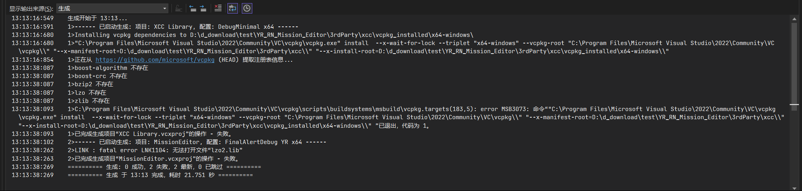
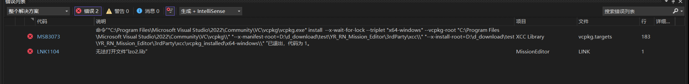

## 编译源码
源码含 2 个项目：
- MissionEditor：主程序
- MissionEditorPackLib：用 C 函数封装 XCC 对象，提供加载/打包逻辑

## 搭建编译环境
- 需要准备以下软件搭建开发环境
  - `Microsoft Visual Studio 2022` (IDE)
  - `Git™ for Windows` (代码仓库Clone)

1. 确保已安装 [Visual Studio Community 2022](https://visualstudio.microsoft.com/zh-hans/vs/) 和 [Git for Windows](https://git-scm.com/install/windows)。此处省略Git安装步骤和配置步骤
2. 启动 `Visual Studio Installer`
3. 点 `Visual Studio Community 2022` 右侧的`修改`按钮，勾选以下内容
    - 工作负载:  
      - 「使用 C++ 的桌面开发」
    - 必须安装的组件(开头带`*`号则可以任意版本号，默认选最新版本即可):
      - MSVC v143 - VS 2022 C++ x64/x86 生成工具(最新)
      - 适用于最新 v143 的 C++ ATL (x86 和 x64)  
      - vcpkg 包管理器
      - 适用于最新 v143 的 C++ MFC (x86 和 x64) 
      - \* Windows 10 SDK  
    - 可选装的组件
      - \* Windows 11 SDK  
4. 应用更改，耐心等待VS安装完成


### 编译步骤（以尤里版为例）
1. 使用`Git™ for Windows`拉取代码仓库，由于使用了子仓库且主分支为`RN`，所以需要递归Clone并切换分支命令如下
    ```bash
    git clone --recursive git@github.com:revengenowstudio/YR_RN_Mission_Editor.git
    cd ./YR_RN_Mission_Editor
    git switch RN
    ```
2. 使用 VS2022 打开代码仓库中的 `MissionEditor.sln`
3. 顶部`解决方案配置`(默认值为「Debug」)切换为「FinalAlertDebug YR」，输出自动指向 `FinalAlert2YR_D.exe`
4. F5 即可自动编译并调试运行，首次拉取代码时VS2022会自动通过vcpkg拉取第三方库源码，请耐心等待。

> [!NOTE]
> 如果选择「FinalAlertRelease YR」编译将获得最佳的性能体验，但会极大地削弱调试能力。此时输出文件为 `FinalAlert2YR.exe`。

> [!NOTE]
> 若编译时VS编译失败，请参见下文 [常见问题](#常见问题)


### 更新三方库
MissionEditor依赖了xcc，而xcc需要使用vcpkg安装一些第三方库，所以编译前需要用vcpkg拉取第三方库源码到本地
VS在启动编译的时候会自动尝试去从vcpkg获取所需要的第三方库源码，只需要确保vcpkg可以通过网络拉取到源码即可

首次编译运行时vcpkg自动隐含了如下操作，如需手动执行:
- 打开「Developer Command Prompt for VS2022」，cd 到 3rdParty\xcc，确认 PATH 含 git & vcpkg：
```
git --version
vcpkg x-update-baseline
```

> [!NOTE]
> XCC 已经搬运至本仓库内，并且进行了裁剪和部分优化，已不再跟随原始版本


## 手动分发
目前本仓库已配置好Github Action流水线，合并PR分支后流水线会自动完成编译和Release工作
若改完代码仍然想手动分发，请先自行核对所有开源协议（含修改声明、版权追加等）。

脚本一键打包：

    cd scripts
    build_and_distribute.bat

生成文件（dist 目录）：
- FinalSun.zip → 泰伯利亚之日版
- FinalAlert2.zip → 红色警戒2 原版
- FinalAlert2YR.zip → 红色警戒2 - 尤里的复仇资料片版本（以及相关的Mod支持）
- MissionEditorSource.zip → 当前仓库源码（不含未提交变更）
- MissionEditorExternalSources.zip → 三方源码/二进制归档（可能含禁止再分发内容，仅留档）

**再强调：分发时务必自行满足本仓库及所有三方库的许可证义务，脚本不保证自动合规。**


## 目录结构速查
- MissionEditor\data\shared：FS/FA2 共用数据
- MissionEditor\data\FinalAlert2：FA2 专有数据
- MissionEditor\data\FinalSun：FS 专有数据
- MissionEditor\PropertySheets：公共属性表，方便管理多配置
- dist：最终输出，含 exe、依赖 DLL 与 data，由 common.props 自动拷贝


## 常见问题

### vcpkg 拉取第三方库源码失败(无法打开文件lzo2.lib)



若编译时遇到上述图片中的报错信息，则一般认为是**vcpkg拉取第三方库源码失败**引起的，根本原因是无法直接访问Github。如果**所在网络环境实在无法直接访问Github**，则需要准备一些**特殊网络工具**来解决这个问题，最好使用支持`TUN模式`的特殊网络工具让vcpkg可以顺利拉取第三方库源码

在处理好网络问题后，跟随以下流程让vcpkg重新开始拉取第三方库源码:
1. 关闭`VS 2022`
2. 使用`CMD`/`PowerShell`进入源码所在文件夹
3. 使用如下命令清空VS 2022创建所有内容，将文件夹恢复成刚刚Clone的状态。注意，这也会删除你保存的任何更改
    ```bash
    git clean -fdx
    ```
4. 使用`VS 2022`重新打开`MissionEditor.sln`，并将`解决方案配置`切换为「FinalAlertDebug YR」，接着按下 F5 编译运行，即可让vcpkg重新拉取第三方库源码